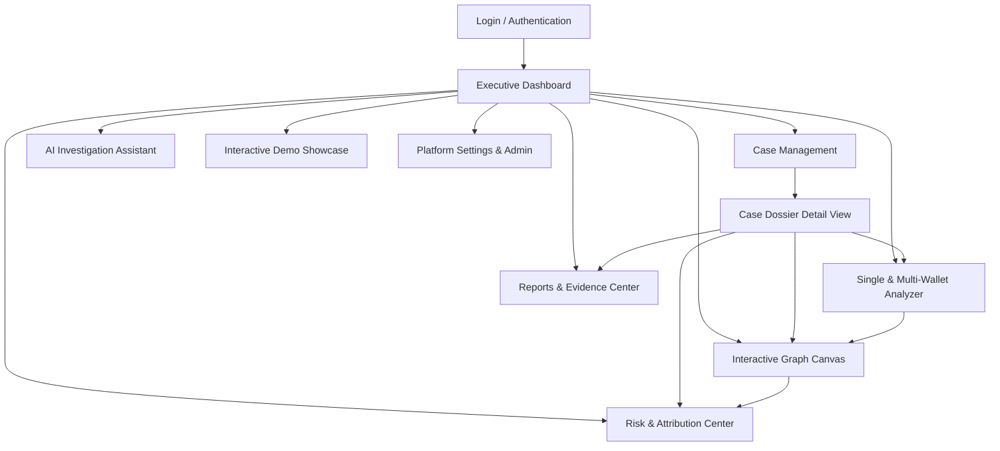
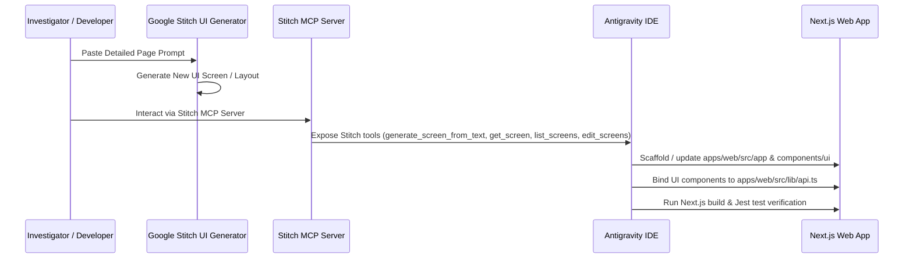

# TRACE-X Frontend Architecture, Page Inventory & Google Stitch Design Blueprint

## Executive Summary & Background

TRACE-X is a real-time cryptocurrency fraud attribution and investigation platform (SIH26183) built for cybercrime investigators, intelligence analysts, and authorized law-enforcement personnel. 

The backend is built with **FastAPI**, **PostgreSQL** (application data), **Neo4j** (fund flow transaction graph), and integrates with **EVM blockchain providers** (Alchemy, Infura, Ethereum, Polygon) along with heuristics for **VASP / Exchange Attribution**, **Mixer & Wash Trading Pattern Detection**, **Explainable Multi-Factor Risk Assessment**, and an **AI Investigation Copilot**.

This document provides:
1. **Full System Architecture & Page Inventory**: Mapping every backend capability to a dedicated, high-impact user interface.
2. **Exhaustive, Copy-Paste Ready Stitch UI Prompts for all 11 Screens**: Providing layout, button coordinates, visual aesthetics, component breakdowns, states, and data fields formatted specifically for **Google Stitch** (`stitch.withgoogle.com`).
3. **Stitch MCP Integration & Sync Architecture**: How to connect the Stitch MCP server to Antigravity IDE to pull designs and generated code directly into the workspace.
4. **Backend-to-Frontend End-to-End Wiring Specification**: Complete API-to-Component binding contracts.

---

## User Review Required

> [!IMPORTANT]
> **Design Language Standard**: All UI designs and Stitch prompts strictly follow the **Premium Fintech SaaS & Modern Banking aesthetic** defined in [DESIGN_SYSTEM_STANDARD.md](file:///home/akshay/trace-x/docs/DESIGN_SYSTEM_STANDARD.md).
>
> - **Atmosphere**: Clean full-bleed SaaS layout (`#F5F7FA` page viewport, NO outer blue border or container), floating white cards (`#FFFFFF`, `rounded-[18px]`), extremely subtle diffused shadows (`0 4px 16px rgba(25, 35, 80, 0.04)`).
> - **Color Tokens**: Primary Royal Indigo (`#3430D9`), Primary Blue (`#3155E7`), Accents: Teal (`#20C7B5`), Pink (`#E96B98`), Purple (`#B52EE8`), Soft Blue (`#6D7CFF`).
> - **Data Integrity**: Full retention of all 11 core TRACE-X investigation workflows and forensic data fields without clutter or boxy dark grids.

---

## Page Inventory & Information Architecture

The TRACE-X platform requires **11 core screens/pages**, structured logically across investigation workflows:



| # | Route | Screen Name | Key Purpose | Stitch Screen ID (Project 401925018996910535) | Primary Backend Binding |
|---|-------|-------------|-------------|-----------------------------------------------|-------------------------|
| 1 | `/(auth)/login` | Secure Access Portal | Analyst / Supervisor authentication with JWT cookies | `70abeb9ab9d244a9893d97c3275088dd` | `POST /auth/login`, `GET /auth/me` |
| 2 | `/(dashboard)/dashboard` | Investigation Command Center | Global metrics, active cases, trace pipeline, system health | `b4da5d14a0ec49488279b32a598bc445` | `GET /cases`, `GET /wallets`, `GET /investigations`, `GET /health` |
| 3 | `/(dashboard)/cases` | Investigations Registry & Management | Filterable registry of criminal investigations & case creation | `e0d2d015ca0c485d8cfa8636b68f5637` | `GET /cases`, `POST /cases`, `PATCH /cases/{id}` |
| 4 | `/(dashboard)/cases/[caseId]` | Case Dossier & Intelligence Detail | Case overview, wallet inventory, trace timeline, risk summary | `fc54ec2854714e39ac91d893a2b261d5` | `GET /cases/{id}`, `GET /wallets?case_id`, `GET /risk/cases/{id}/risk-summary` |
| 5 | `/(dashboard)/analyze` | Single & Multi-Wallet Analyzer | Real-time address validation, multi-hop tracing, tx explorer | `2f1d33e5371e4e90abd16a905fcd3b12` | `POST /analysis/wallets/validate`, `POST /analysis/cases/{id}/wallets/analyze`, `POST /analysis/wallets/{id}/trace` |
| 6 | `/(dashboard)/graph` | Interactive Investigation Graph | 2D/3D Node-link graph (React Flow), path-to-VASP, clustering | `35a3fcff1ad04a8780a3547f3424824d` | `POST /graph/subgraph`, `POST /graph/wallets/{id}/paths-to-vasp`, `POST /graph/patterns/detect` |
| 7 | `/(dashboard)/risk` | Risk & VASP Attribution Engine | 12-factor explainable risk gauge, confidence badges, VASP off-ramp | `b29b5efd323844c89e9af63395a37ad9` | `POST /risk/wallets/{id}/assess`, `GET /risk/wallets/{id}/attribution`, `POST /risk/wallets/{id}/attribute` |
| 8 | `/(dashboard)/ai` | AI Investigation Copilot | Multi-turn chat assistant, query classification, narrative generator | `056889cb0fda42138162760eb3b68797` | `POST /ai/chat`, `POST /ai/query`, `POST /ai/generate-narrative`, `GET /ai/capabilities` |
| 9 | `/(dashboard)/demo` | Competition & Demo Showcase | Pre-built high-profile scenarios (DeFi, LockBit, OFAC) with 1-click runs | `a388a9f377d449b79acbce0ebf32e202` | Pre-seeded scenarios calling trace, graph, risk, and attribution APIs |
| 10 | `/(dashboard)/reports` | Forensic Reports & Evidence Archive | Court-admissible PDF/HTML evidence builder & chain of custody | `91db3cb5130c49f7baf064b398983dd1` | `GET /reports`, `POST /risk/reports/generate`, `GET /risk/reports/{id}/download` |
| 11 | `/(dashboard)/settings` | System Admin & Node Health | Provider API keys, Neo4j/Postgres status, user & role management | `167b64d19ff442a2acaada812746878a` | `GET /auth/users`, `POST /auth/users`, `PATCH /auth/users/{id}`, `GET /health` |

---

## Detailed Google Stitch Prompts (Page by Page)

Copy and paste these exact prompts directly into **Google Stitch** (`stitch.withgoogle.com`) to generate pixel-perfect, feature-complete designs.

---

### Page 1: Secure Access Portal (Login Screen)
*Route: `/(auth)/login`*

```text
Design a hyper-sleek, high-security authentication portal for "TRACE-X - Real-Time Cryptocurrency Fraud Attribution Platform", designed for law enforcement and cybercrime investigators.

Design Aesthetic:
- Dark cyber-forensic theme: Deep obsidian background (#090D16), subtle grid background with glowing radial cyan gradient at the center.
- Card container: Centered glassmorphism card with border-slate-800, backdrop-blur-xl, subtle neon blue glow on hover.

Header / Brand:
- Centered Shield icon inside a glowing indigo badge with text: "TRACE-X INTELLIGENCE SYSTEM".
- Subtitle badge: "Authorized Law Enforcement & Analyst Access Only (SIH26183)".
- Title: "Sign in to Investigation Console".
- Description: "Enter your official credentials and security token to access case intelligence."

Form Components (Vertical Stack):
1. Email Input:
   - Label: "Official Email Address" with Mail icon.
   - Placeholder: "investigator@cybercrime.gov.in"
   - Border: Dark slate border (#1E293B) transitioning to electric cyan on focus (#06B6D4).
2. Password Input:
   - Label: "Password" with Lock icon.
   - Placeholder: "••••••••••••"
   - Include a "Show/Hide Password" eye toggle icon on the far right.
3. Agency Badge & Token Selection (Row):
   - Left: Select dropdown "Investigator Role" (Options: Cyber Cell Analyst, Senior Supervisor, Forensic Admin).
   - Right: "Remember this terminal for 8 hours" checkbox with switch style.
4. Error State Banner (Hidden by default, styled for preview):
   - Red alert box (#EF4444 with 10% opacity) with AlertCircle icon: "Invalid credentials or unauthorized terminal IP."
5. Primary Action Button:
   - Large full-width button: "Authenticate & Enter Console" with a glowing cyan-to-blue gradient (#0284C7 to #2563EB), white bold text, and an ArrowRight icon.
   - Include a loading spinner state indicator variant.
6. Bottom Footer within card:
   - Security Notice: "Protected under Official Secrets & IT Act. All sessions and queries are tamper-evident and audit-logged." with tiny ShieldCheck icon.
```

---

### Page 2: Executive Investigation Command Center (Dashboard)
*Route: `/(dashboard)/dashboard`*

```text
Design an executive dashboard for "TRACE-X: Cryptocurrency Fraud Attribution Platform", displaying real-time analytics for active cybercrime investigations.

Global Layout:
- Topbar: Case search input ("Search wallet 0x..., case number TRX-..., or entity..."), Live Status indicator ("Neo4j Connected • Block #19842102"), Notification bell with badge "3", and User Profile avatar ("Insp. Rajesh Kumar • Senior Analyst").
- Left Sidebar (collapsible): Dashboard (active), Cases, Analyze, Graph Visualizer, Risk & Attribution, AI Copilot, Demo Scenarios, Reports, Settings.

Top Stats Row (4 Metric Cards):
1. Card 1: "Active Investigations" -> Value: "42", badge: "+5 this week" (emerald), Icon: FolderOpen (blue).
2. Card 2: "Suspect Wallets Tracked" -> Value: "1,284", badge: "Multi-Chain EVM" (indigo), Icon: Search (cyan).
3. Card 3: "Attributed VASPs / Exchanges" -> Value: "318", badge: "89% Confirmed" (emerald), Icon: ShieldCheck (emerald).
4. Card 4: "Total Fraud Volume Traced" -> Value: "$14.8M USD" (or 4,210 ETH), badge: "High Risk", Icon: AlertTriangle (crimson).

Main Grid - Two Column Layout (60% / 40%):
- Left Column (Investigation Pipeline & Recent Cases):
  - Card Header: "Active Case Dossiers" with "View All (42)" button (outline) and "+ New Case" button (primary cyan).
  - Table: Columns: [Case ID, Case Title, Crime Type Badge (Fraud, Ransomware, Laundering), Status (Open, In Progress, Attributed), Tracked Wallets, Nearest VASP, Last Action].
  - Row item example: "TRX-2024-0042", "DeFi Flash Loan Drainer", "Fraud" (orange badge), "In Progress" (amber), "6 Wallets", "Binance (Confirmed)", "2 mins ago". Include a quick "Trace" action button on the far right.
- Right Column (Live Attribution & System Telemetry):
  - Top Card: "Live VASP Attribution Stream": A timeline feed showing suspect funds hitting exchanges in real time. Items show: [Suspect Wallet -> 2 hops -> Kraken Deposit Wallet] with a glowing green "CONFIRMED" badge and timestamp.
  - Bottom Card: "Platform Health & Blockchain Sync": 3 status chips:
    1. PostgreSQL: Healthy (12ms latency)
    2. Neo4j Graph DB: Synced (142,800 nodes, 310,200 edges)
    3. Alchemy RPC (Ethereum / Polygon): Active (Block #19842102)

Bottom Full-Width Card:
- "High-Risk Alert Feed": Horizontal scroll of high-priority detections: "Tornado Cash 100 ETH peel-chain detected in Case TRX-2024-0038" with quick button: "Launch Graph".
```

---

### Page 3: Case Management & Registry Page
*Route: `/(dashboard)/cases`*

```text
Design the Case Management and Registry screen for the TRACE-X cybercrime investigation platform.

Header Area:
- Title: "Case Dossiers & Registry"
- Subtitle: "Manage, track, and assign formal cryptocurrency fraud investigations."
- Action Bar (Right side):
  - "+ Create New Case" primary button (electric blue with Plus icon).
  - "Export Registry (CSV)" secondary button.

Filter & Search Toolbar:
- Left: Search box with Search icon: "Search cases by ID, title, suspect name, or victim reference...".
- Middle: Filter Dropdown "Status": All, Open, In Progress, Closed, Archived.
- Middle: Filter Dropdown "Crime Type": All, Fraud, Money Laundering, Ransomware, Darknet Market, Sanctions Evasion.
- Right: Sort Dropdown: "Recently Updated", "Highest Risk First", "Most Wallets".

Main Case Registry Table / Grid Toggle:
- Include a segmented control toggle: Table View vs Card Grid View.
- Table Columns:
  1. Case Number (mono font, e.g., TRX-20240115-0042)
  2. Case Title & Brief Description (truncated)
  3. Crime Classification (Badges: Fraud, Ransomware, Darknet, Sanctions)
  4. Assigned Officer (Avatar + Name)
  5. Wallets Count & Chains (e.g., 6 wallets • ETH, MATIC)
  6. Overall Risk Score (Pill with 0-100 score: Green <30, Yellow 30-70, Red >70)
  7. Attribution Status (Unverified, Under Review, Attributed, Confirmed)
  8. Created & Updated Date
  9. Actions Menu: "Open Dossier", "Launch Trace", "Generate Report", "Archive"

Modal / Dialog ("+ Create New Case"):
- Title: "Register New Crypto Fraud Case"
- Form Fields:
  - Case Title (Input)
  - Crime Category (Select: Fraud, Money Laundering, Ransomware, Darknet Market, Sanctions Evasion, Other)
  - Victim Complaint / FIR Reference ID (Input)
  - Primary Suspect Wallet Address (Input with real-time EVM checksum validation icon)
  - Blockchain Network (Select: Ethereum Mainnet, Polygon, Arbitrum, Binance Smart Chain)
  - Case Description & Intel Background (Textarea, 4 rows)
  - Priority Level (Radio buttons: Low, Medium, High, Urgent)
- Modal Actions: "Cancel" (Ghost) and "Initialize Case Dossier" (Primary Cyan).
```

---

### Page 4: Case Dossier & Intelligence Detail View
*Route: `/(dashboard)/cases/[caseId]`*

```text
Design the comprehensive Case Dossier & Intelligence Detail screen for TRACE-X.

Case Header Banner:
- Top breadcrumb: "Cases / TRX-20240115-0042 / Dossier"
- Left: Case Number (large mono font "TRX-20240115-0042"), Case Title ("DeFi Protocol Flash Loan Exploit & Mixer Laundering"), Crime Type badge ("FRAUD", orange), Status badge ("IN PROGRESS", amber).
- Center Meta: Assigned to "Inspector Rajesh Kumar" • Created "Jan 15, 2024" • Updated "10 mins ago".
- Right Action Buttons:
  - "+ Add Suspect Wallet" (Primary button)
  - "Launch Graph View" (Outline button with GitBranch icon)
  - "Generate Evidence Report" (Secondary button with FileText icon)
  - "Case Settings" (Icon button)

Tabbed Navigation Interface (5 Tabs):
1. Overview & Intel Briefing (Active)
2. Suspect Wallets & Addresses (Badge: 6)
3. Fund Flow Traces & Investigation Runs (Badge: 4)
4. Identified VASPs & Exchanges (Badge: 2)
5. Evidence & Audit Chain of Custody

Tab 1 Content (Overview & Intel Briefing):
- 4 Quick-Metric Cards:
  1. Average Risk Score: 92/100 (Critical Red)
  2. Total Fraud Inflow: 485.5 ETH ($1.42M USD)
  3. Identified Exchange Off-Ramps: 2 (Binance, Bybit)
  4. Mixer Interaction: Yes (Tornado Cash detected at Hop 2)
- Two Columns:
  - Left: "Case Narrative & Background" card (rich markdown with collapsible investigation notes).
  - Right: "VASP Attribution Summary Card": Shows the nearest exchange reached by the suspect fund flow, distance (hops), confidence score (96% CONFIRMED), deposit transaction hash with link to Etherscan, and recommended LEA Subpoena contact info.

Tab 2 Content (Suspect Wallets Table):
- Search & Add Wallet bar.
- Table: [Address, Chain, Label/Role, Risk Score Gauge, Attribution State, Entity Tag, Actions ("Analyze", "Trace Flow", "Remove")].
```

---

### Page 5: Single & Multi-Wallet Analyzer
*Route: `/(dashboard)/analyze`*

```text
Design the Single & Multi-Wallet Real-Time Forensic Analyzer screen for TRACE-X.

Header Area:
- Title: "Wallet Analyzer & Multi-Hop Flow Engine"
- Subtitle: "Validate suspect addresses, fetch live on-chain transactions, and execute recursive fund flow tracing."

Input Control Console (Glassmorphic Card):
- Step 1: Case Selector Dropdown ("Select Active Case: TRX-2024-0042 - DeFi Exploit" or "+ New Case").
- Step 2: Address Input Bar:
  - Large input field with Search icon: "Enter Ethereum or Polygon wallet address (0x...)".
  - Right of input: Live Validation Chip ("Valid EVM Address • Ethereum Mainnet detected" with green checkmark).
- Step 3: Trace Configuration Parameters (Row of 3 controls):
  - Chain Selector: Auto-detect, Ethereum (0x1), Polygon (0x89), Arbitrum (0x2105).
  - Max Trace Depth Slider: 1 to 6 hops (Current: 3 hops).
  - Minimum Value Filter: e.g., "> 0.5 ETH" input to eliminate dusting attacks.
- Action Button:
  - Large button: "Execute Recursive Trace & Entity Attribution" (Glowing cyan gradient with Zap icon).

Live Execution Stepper Bar (Appears when analyzing):
- 5-step progress visualization:
  1. Validate Address (Done) -> 2. Query Mempool & Blocks (Done) -> 3. Recursive Hop Crawling (In Progress, 65%) -> 4. Neo4j Graph Ingestion (Pending) -> 5. VASP & Risk Attribution (Pending).

Results Workspace (Two Tabs: "Detected Patterns & Attribution" and "Transaction Ledger"):
- Tab 1:
  - "Nearest Identified VASP" Card: Banner showing "Binance Deposit Wallet Identified at Hop 2 with 94% High Confidence".
  - "Suspicious Behavioral Patterns" Grid: 3 pattern badges:
    1. Peel Chain Movement (Medium severity, 4 hops, 85 ETH total)
    2. Mixer Interaction (Critical severity, Tornado Cash router at hop 1)
    3. Rapid Dissipation (High severity, 90% funds moved within 14 minutes)
- Tab 2:
  - Full Paginated Transaction Table: [Tx Hash, Block Number, Timestamp, From Address, To Address, Value ETH, Value USD, Method/Contract, Suspicious Flag (Red/Green)].
```

---

### Page 6: Interactive Investigation Graph Canvas
*Route: `/(dashboard)/graph`*

```text
Design an advanced, full-screen Interactive Investigation Graph Canvas for cryptocurrency fund flow tracking in TRACE-X (based on React Flow & Neo4j).

Canvas Viewport & Layout:
- Dark cyber-grid canvas background with pan, pinch-to-zoom, and smooth drag.
- Top Floating Control Bar (Glassmorphic overlay):
  - Wallet search / jump input.
  - Hop Depth Slider (1 to 5 hops).
  - Filter Toggles: [Show Only Exchanges, Highlight Mixers, Hide Low Value < 0.1 ETH, Show Attribution Links].
  - Layout Switcher: "Dagre Hierarchical Flow", "Force Directed Organic", "Radial Tree".
  - Actions: "Re-layout Graph", "Export SVG/PNG", "Save Graph Snapshot to Case", "Full Screen".

Interactive Node Types & Visual Styles:
1. Suspect Wallet Node (Root):
   - Red border (#EF4444), skull/alert icon, address snippet (0x742d...0bEb), Label: "Primary Suspect", Risk Badge: "95 High".
2. Intermediary Wallet Node:
   - Slate border (#64748B), wallet icon, address snippet, Risk Badge: "64 Med", outgoing transaction count.
3. Exchange / VASP Node (Destination Off-Ramp):
   - Emerald glowing border (#10B981), Bank/Exchange icon, Entity Name: "Binance: Hot Wallet 6", Confidence: "CONFIRMED 98%".
4. Mixer / Smart Contract Node:
   - Purple dashed border (#A855F7), Tornado/Layers icon, Label: "Tornado.Cash: 100 ETH Pool".

Interactive Edge Types (Flow Lines):
- Real On-Chain Transfer: Solid animated glowing cyan line with arrow indicator and value pill ("45.5 ETH / $128,400 USD").
- Inferred / Attribution Link (BELONGS_TO): Dashed purple edge with label "Cluster Association".

Floating Sidebars:
- Right Inspector Panel (Collapsible Drawer):
  - Opens when investigator clicks any node or edge.
  - Node Inspector displays: Full Address (with 1-click Copy & Etherscan link), Entity Classification, Balance, Inflow vs Outflow, First/Last Active Date, Risk Factors breakdown, and button: "Add to Case Report".
- Bottom Left Mini-Map & Zoom Controls:
  - Minimap thumbnail of the entire cluster, Zoom in, Zoom out, Fit-to-screen button.
```

---

### Page 7: Risk & VASP Attribution Engine Page
*Route: `/(dashboard)/risk`*

```text
Design the Risk Assessment & VASP Attribution Engine screen for TRACE-X, delivering fully explainable cryptocurrency forensic scoring.

Header Area:
- Title: "Explainable Risk & VASP Attribution Engine"
- Subtitle: "Heuristic evidence breakdown, regulatory compliance flags, and nearest exchange identification."
- Quick Switcher: Case / Wallet selector dropdown.

Top Row: Dual Intelligence Overview (2 Large Cards):
- Card 1: "Overall Risk Assessment Gauge":
  - Radial semi-circle speedometer gauge showing score: "94 / 100 - CRITICAL RISK".
  - Risk Level Badge: "CRITICAL" (Crimson background, white bold text).
  - Summary text: "This wallet has direct 1-hop exposure to OFAC-sanctioned smart contracts, exhibits peel-chain layering behavior, and deposited remaining proceeds into a regulated VASP within 4 hours of victim theft."
- Card 2: "Nearest Identified VASP (Off-Ramp Attribution)":
  - Large verified badge: "Binance Exchange (USDT/ETH Deposit)".
  - Attribution Confidence: "CONFIRMED (Score: 98/100)".
  - Path Distance: "2 Hops from Suspect Address".
  - Deposit Hash: "0x3f8a...9c12" with link.
  - Action Button: "Generate LEA Lawful Intercept / Subpoena Notice" (Primary button with Shield icon).

Middle Section: 12-Factor Explainable Risk Breakdown Table (Active Heuristics View):
- Note: The TRACE-X risk scoring engine evaluates 12 heuristic factors: Mixer Interaction (0.25), Peel Chain (0.20), Sanctions Hit (0.30), High-Risk Entity (0.15), Rapid Movement (0.10), Round Amounts (0.08), Large Value Transfer (0.07), Cross-Chain Bridge (0.05), Contract Interaction (0.05), New Wallet (0.03), Low-Liquidity Token (0.02), Dusting Attack (0.02).
- Header: "Heuristic Factor Analysis & Weight Distribution (12 Scoring Vectors)"
- Table Columns: [Factor Type, Severity (Critical, High, Medium, Low), Score Contribution (0-100), Weight %, Description, Evidence Source, Confidence Level].
- Row 1: "Mixer / Privacy Pool Interaction" -> Severity: Critical -> Score: 98 -> Weight: 25% -> "Direct deposit into Tornado Cash 100 ETH contract" -> Source: On-chain -> CONFIRMED.
- Row 2: "Peel Chain Layering" -> Severity: High -> Score: 85 -> Weight: 20% -> "Sequential splitting of 50 ETH into 4 sub-wallets with small remainder" -> Source: Heuristic -> HIGH_CONFIDENCE.
- Row 3: "Rapid Asset Dissipation" -> Severity: High -> Score: 90 -> Weight: 10% -> "Funds drained and transferred within 18 minutes of intake" -> Source: Temporal Analysis -> CONFIRMED.
- Row 4: "High-Risk / Sanctioned Entity Hit" -> Severity: Critical -> Score: 100 -> Weight: 30% -> "Direct counterparty listed on OFAC SDN list" -> Source: Intelligence DB -> CONFIRMED.
- Row 5: "New Wallet Age & Rapid Inflow" -> Severity: Low -> Score: 40 -> Weight: 3% -> "Wallet created 2 hours prior to exploit" -> Source: Block Explorer -> CONFIRMED.
- Row 6: "Cross-Chain Bridge / DEX Swap" -> Severity: Medium -> Score: 60 -> Weight: 5% -> "Uniswap V3 swap ETH -> DAI followed by bridge transfer" -> Source: On-Chain -> CONFIRMED.

Bottom Section: "Attribution Evidence Chain":
- Visual path stepper: [Suspect Wallet 0x742d...] --(Hop 1: 50 ETH)--> [Intermediary 0x8aD1...] --(Hop 2: 48.5 ETH)--> [Binance Deposit 0x1599...].
- Evidence metadata tags: Block timestamp, Gas used, Corroborating entity databases (Chainalysis, CipherTrace, OFAC SDN).
```

---

### Page 8: AI Investigation Assistant & Case Narrative Copilot
*Route: `/(dashboard)/ai`*

```text
Design the AI Investigation Copilot and Case Narrative Assistant screen for TRACE-X.

Layout Architecture:
- Left Sidebar (25% width):
  - "+ New Investigation Chat" button.
  - Capabilities & Query Shortcuts:
    - ⚡ "Risk Analysis Query"
    - 🏢 "VASP Attribution Lookup"
    - 🔄 "Peel Chain / Mixer Detection"
    - 📊 "Case Executive Summary"
    - 📝 "Generate Court-Ready Narrative"
  - Active Case Context Pill: "Context: TRX-2024-0042 (DeFi Exploit)".
  - Past Chat History Sessions list with timestamps and delete buttons.

Main Chat & Analysis Window (75% width):
- Chat Header:
  - Bot Avatar with glowing cyan spark icon: "TRACE-X Forensics AI Copilot".
  - Status: "Active • Model: Gemma/Gemini Forensic Fine-Tuned • Neo4j Connected".
  - Action: "Generate Full Case Dossier Narrative" button (Outline).

Message Feed Area:
1. System Welcome Message:
   - "Greetings, Investigator. I am synchronized with case TRX-2024-0042 and the Neo4j fund flow graph. Ask me about wallet connections, exchange attributions, or request an evidence narrative for legal filing."
   - Quick Prompt Chips:
     - "Which exchange did the stolen funds end up in?"
     - "Show me all intermediary wallets with > 10 ETH volume"
     - "Draft an FIR / Court Affidavit narrative for this case"
2. User Message Bubble (Right aligned, dark slate container):
   - "Which exchange did suspect wallet 0x742d35Cc6634C0532925a3b844Bc9e7595f0bEb send funds to, and what is our confidence level?"
3. Assistant Intelligence Response Bubble (Left aligned, sleek glassmorphism with cyan accent line):
   - Executive Answer: "Based on multi-hop recursive graph analysis, suspect wallet 0x742d... deposited a net total of **48.5 ETH** into **Binance** via intermediary deposit address **0x159939f79D0B3D4e752912fA658A4D3776c9b5e3** at Hop 2."
   - Attribution Confidence Card:
     - Entity: "Binance Exchange"
     - Confidence: "CONFIRMED (98%)" with emerald badge
     - Hop Distance: "2 Hops"
     - Deposit Tx: `0x3f8a9e...` (clickable)
   - Explainable Reasoning Bullet points:
     - 1. Funds originated from suspect wallet on 2024-01-15 04:12 UTC.
     - 2. Was split through peel chain wallet 0x8aD1... (Hop 1).
     - 3. Reached Binance cluster deposit hot wallet (Hop 2).
   - Suggested Follow-up Buttons:
     - "Generate Law Enforcement Subpoena Notice for Binance"
     - "Inspect Hop 1 Intermediary Wallet"
     - "Add this finding to Official Report"

Bottom Input Bar:
- Context tag: "Case TRX-2024-0042 attached".
- Large textarea: "Ask a forensic question or request analysis...".
- Attachment icon, Voice input icon, and Send button (cyan gradient with Send icon).
```

---

### Page 9: Competition & Live Demo Showcase Page
*Route: `/(dashboard)/demo`*

```text
Design the Competition & Live Demo Showcase screen for "TRACE-X (SIH26183)", tailored for judges, evaluators, and law-enforcement demonstrations.

Header Banner:
- Title: "TRACE-X Forensic Demonstration Center"
- Subtitle: "Pre-configured real-world cybercrime scenarios demonstrating automated real-time VASP attribution and blockchain analytics."
- SIH Badge: "Smart India Hackathon SIH26183 Showcase".

Scenario Selector (5 Interactive Cards in a Horizontal Carousel / Grid):
1. Scenario 1 (Featured): "DeFi Protocol Flash Loan Exploit"
   - Tag: "FRAUD • $1.4M USD", Badge: "ETH + MATIC", Risk: "95 Critical".
   - Description: Attacker borrowed 50,000 ETH via flash loan, drained liquidity, layered through Tornado Cash and deposited to Binance.
2. Scenario 2: "LockBit 3.0 Ransomware Payment Tracing"
   - Tag: "RANSOMWARE • 25 BTC Eq.", Badge: "Arbitrum", Risk: "92 Critical".
   - Description: Victim paid ransom; funds split across Wasabi CoinJoin and moved to Kraken nested exchange.
3. Scenario 3: "International Money Laundering Ring"
   - Tag: "MONEY LAUNDERING • $5M", Badge: "Multi-Chain", Risk: "82 High".
   - Description: Network of 40+ peel wallets routing round amounts into Huobi, OKX, and Gate.io.
4. Scenario 4: "Hydra Darknet Market Successor Seizure"
   - Tag: "DARKNET • Vendor Escrow", Badge: "Polygon Bridge", Risk: "75 High".
   - Description: Vendor bond escrow laundering traced through Polygon bridge to Bybit deposit accounts.
5. Scenario 5: "OFAC Sanctions Evasion - Oligarch Crypto"
   - Tag: "SANCTIONS • $50M Assets", Badge: "BSC + ETH", Risk: "99 Critical".
   - Description: SDN-listed wallet routing through Railgun and cross-chain DEX pools.

Active Scenario Interactive Stage:
- Top Bar: Selected Scenario Name with "Run Automated Attribution Simulation" primary button (glowing green Play icon).
- Live Simulation Terminal / Progress Log (Left 40%):
  - Step-by-step terminal log showing real-time execution:
    `[00:01] Validating suspect wallet 0x742d35Cc66... OK`
    `[00:03] Crawling Ethereum block #19842102... 14 transactions found`
    `[00:06] Executing recursive 3-hop graph traversal in Neo4j...`
    `[00:08] PATTERN DETECTED: Tornado Cash 100 ETH pool interaction at Hop 1`
    `[00:10] VASP IDENTIFIED: 0x1599... maps to Binance Cluster #4 (CONFIRMED)`
    `[00:12] Generating forensic risk score: 95/100 (CRITICAL)`
- Visual Outcome Showcase (Right 60%):
  - Mini Graph Preview with highlighted path from suspect to Binance.
  - VASP Attribution Result Card with 1-click button: "View Full Interactive Graph" or "Export Forensic Evidence Dossier".
```

---

### Page 10: Forensic Reports & Evidence Archive
*Route: `/(dashboard)/reports`*

```text
Design the Court-Admissible Forensic Evidence & Reports screen for TRACE-X.

Header Area:
- Title: "Forensic Reports & Evidence Locker"
- Subtitle: "Generate and manage court-admissible forensic cryptocurrency investigation reports (Section 65B Indian Evidence Act compliant)."
- Right Action: "+ Generate New Investigation Report" button (Primary cyan).

Top Metrics:
- 3 Quick Cards:
  1. Total Reports Generated: "18"
  2. Certified Evidence Hash Chain: "SHA-256 Verified" (Emerald badge)
  3. Formats Supported: PDF, HTML, JSON (Law Enforcement API Ready)

Filter & Search Toolbar:
- Search input: "Search by report title, case ID, or suspect wallet...".
- Format Filter: All, PDF, HTML, JSON.
- Date Range Picker: Last 7 days, Last 30 days, Custom Range.

Reports Archive Table:
- Columns:
  1. Report Title & Document ID (e.g., "Forensic Attribution Report - Case TRX-2024-0042")
  2. Associated Case Number (clickable link)
  3. Format Badge (PDF with red icon, HTML with blue icon, JSON with green icon)
  4. Generated By (Officer Name & Agency ID)
  5. File Size & Checksum (e.g., "2.4 MB • SHA256: 9e8f...a12c")
  6. Date Generated
  7. Actions:
     - "Download Report" (Download icon)
     - "Preview Online" (Eye icon)
     - "Copy Cryptographic Hash" (Clipboard icon)

Modal / Builder Dialog ("Generate New Investigation Report"):
- Title: "Forensic Evidence Report Generator"
- Stepper Form:
  - Step 1: Select Case Dossier (Dropdown of active cases)
  - Step 2: Report Template Selection:
    - Option A: "Standard LEA Prosecution Dossier (Comprehensive)"
    - Option B: "VASP / Exchange Emergency Subpoena Request"
    - Option C: "Executive Risk & Intelligence Brief"
  - Step 3: Evidence Components to Include (Checkboxes):
    - [x] Complete Transaction Ledger
    - [x] Neo4j Graph Snapshot & Path Visualization
    - [x] Explainable Risk Factor Heuristics Breakdown
    - [x] VASP Identification & Exchange Contact Directory
    - [x] AI Synthesized Case Narrative
    - [x] Cryptographic Hash & Digital Signature Certificate
  - Step 4: Export Format (Radio: PDF, HTML, JSON)
- Actions: "Cancel" and "Compile & Sign Forensic Report" (Primary Cyan).
```

---

### Page 11: Platform Settings, Node Health & Administration
*Route: `/(dashboard)/settings`*

```text
Design the Platform Settings, Infrastructure Health, and User Administration screen for TRACE-X.

Header Area:
- Title: "Platform Settings & Administration"
- Subtitle: "Manage blockchain RPC nodes, database sync, user roles, security policies, and audit trails."

Navigation Tabs (5 Tabs):
1. General Settings
2. Blockchain Providers & RPCs
3. Database & Graph Ingestion
4. User Management & Roles
5. Security & Tamper-Evident Audit Logs

Tab 2 Content (Blockchain Providers & RPCs):
- Active Providers List:
  - Card 1: "Ethereum Mainnet (Alchemy / Infura)" -> Status: Connected (Block #19842102) • API Key: `alc_••••••••` • Latency: 42ms • Monthly Quota: 45% used.
  - Card 2: "Polygon PoS Network" -> Status: Connected (Block #54891024) • Latency: 38ms.
  - "+ Add Custom EVM RPC Endpoint" button with Chain ID, RPC URL, and Explorer URL inputs.

Tab 3 Content (Database & Graph Ingestion):
- PostgreSQL Status: 100% Operational • 12 Connection Pools Active.
- Neo4j Graph Database: Connected via Bolt protocol • 142,800 Nodes • 310,200 Edges • Memory: 1.8GB / 4.0GB.
- Button: "Trigger Full Graph Index Re-sync" (Warning outline button).

Tab 4 Content (User Management & Roles):
- Header: "Authorized Personnel Directory" with "+ Add Authorized Officer" button.
- User Table: [Officer Name, Agency Email, Role (Analyst, Supervisor, Admin), Status (Active, Suspended), Last Login, Actions (Edit Role, Deactivate)].
- Add User Modal: Full Name, Official Email, Password, Role selector.

Tab 5 Content (Security & Tamper-Evident Audit Logs):
- Real-time audit log stream showing every search, case creation, and report export:
  - Format: `[Timestamp] [User] [Action] [Target Resource] [IP Address] [Cryptographic Hash]`
  - Example: `2024-01-15 14:22:01 • insp.rajesh • GENERATE_REPORT • TRX-2024-0042 • 10.0.4.12 • a8f9...c4`
  - "Export Audit Log (Signed CSV)" button.
```

---

## Google Stitch MCP Integration & Code Sync Strategy

Google Stitch provides modern generative UI capabilities to generate pixel-perfect screens for all TRACE-X investigation workflows.



### 1. Generating New Screens in Stitch
Each prompt in Section 3 is self-contained and ready to generate a brand new screen:
- **Direct Web Generation**: Copy any page prompt directly into [Stitch](https://stitch.withgoogle.com) to generate the visual screen and component tree.
- **MCP Tool Generation**: Alternatively, use Stitch MCP tools (`generate_screen_from_text`, `create_project`) to programmatically create and refine screens for the new design.

### 2. Component Synchronization Pipeline
When importing or syncing newly generated screens:
1. Inspect the generated screen layout and code via Stitch MCP's `get_screen` or direct export.
2. Structure the components cleanly into `apps/web/src/components/` and the target routes in `apps/web/src/app/(dashboard)/...`.
3. Standardize icons using `lucide-react`.
4. Re-use existing UI primitives from `apps/web/src/components/ui/` (`Button`, `Card`, `Badge`, `Table`, `Tabs`, `Dialog`, etc.).

---

## End-to-End Frontend-to-Backend Wiring Specification

Below is the complete wiring contract connecting the UI components directly to the existing `apps/web/src/lib/api.ts` clients and FastAPI backend:

```
┌────────────────────────────────────────┬──────────────────────────────────────────┬────────────────────────────────────────┐
│ UI Screen Component                   │ API Client Method in lib/api.ts         │ Backend FastAPI Endpoint               │
├────────────────────────────────────────┼──────────────────────────────────────────┼────────────────────────────────────────┤
│ LoginPage (Form submit)                │ useAuthStore.getState().login()          │ POST /api/v1/auth/login                │
│ DashboardPage (Metrics & Tables)       │ casesApi.list({ page: 1, page_size: 5 }) │ GET /api/v1/cases                      │
│                                        │ walletsApi.list({ page_size: 1 })        │ GET /api/v1/wallets                    │
│                                        │ investigationsApi.list(...)              │ GET /api/v1/investigations             │
│                                        │ healthApi.check()                        │ GET /api/v1/health                     │
│ CasesPage (Registry & Create Modal)    │ casesApi.list({ status, crime_type })    │ GET /api/v1/cases                      │
│                                        │ casesApi.create(formData)                │ POST /api/v1/cases                     │
│ CaseDetailPage (Dossier & Tabs)        │ casesApi.get(caseId)                     │ GET /api/v1/cases/{caseId}             │
│                                        │ walletsApi.list({ case_id: caseId })     │ GET /api/v1/wallets?case_id={id}       │
│                                        │ investigationsApi.list({ case_id })      │ GET /api/v1/investigations?case_id=    │
│                                        │ riskApi.getCaseRiskSummary(caseId)       │ GET /api/v1/risk/cases/{id}/risk-sum.. │
│ AnalyzePage (Validation & Trace)       │ analysisApi.validateAddress(addr, chain) │ POST /api/v1/analysis/wallets/validate │
│                                        │ analysisApi.analyzeWallet(caseId, req)   │ POST /api/v1/analysis/cases/{id}/wall..│
│                                        │ analysisApi.getWalletTransactions(wId)   │ GET /api/v1/analysis/wallets/{id}/txs  │
│ GraphPage (Canvas & Subgraph)          │ graphApi.getSubgraph({ addresses, ... }) │ POST /api/v1/graph/subgraph            │
│                                        │ graphApi.findPathsToVASP(walletId, req)  │ POST /api/v1/graph/wallets/{id}/paths..│
│                                        │ graphApi.detectPatterns(req)             │ POST /api/v1/graph/patterns/detect     │
│ RiskPage (Score & VASP Attribution)    │ riskApi.assessWallet(walletId)           │ POST /api/v1/risk/wallets/{id}/assess  │
│                                        │ riskApi.getAttribution(walletId)         │ GET /api/v1/risk/wallets/{id}/attribu..│
│ AIAssistantPage (Chat & Query)         │ aiApi.chat({ message, session_id, ... }) │ POST /api/v1/ai/chat                   │
│                                        │ aiApi.generateNarrative(caseId)          │ POST /api/v1/ai/generate-narrative     │
│                                        │ aiApi.getCapabilities()                  │ GET /api/v1/ai/capabilities            │
│ ReportsPage (List, Gen & Download)     │ reportsApi.list({ page, page_size })     │ GET /api/v1/reports                    │
│                                        │ riskApi.generateReport(req)              │ POST /api/v1/risk/reports/generate     │
│                                        │ riskApi.downloadReport(reportId)         │ GET /api/v1/risk/reports/{id}/download │
│ SettingsPage (Users & System)          │ authApi.listUsers()                      │ GET /api/v1/auth/users                 │
│                                        │ authApi.createUser(userData)             │ POST /api/v1/auth/users                │
│                                        │ authApi.updateUser(userId, data)         │ PATCH /api/v1/auth/users/{id}          │
│                                        │ healthApi.check()                        │ GET /api/v1/health                     │
└────────────────────────────────────────┴──────────────────────────────────────────┴────────────────────────────────────────┘
```

---

## Verification & Execution Plan

### Step-by-Step Implementation Flow

1. **Step 1: User Approval & Stitch Generation**:
   - The user selects the page(s) to generate in Google Stitch using the provided prompts.
   - User reviews the resulting UI layouts in Stitch.
2. **Step 2: MCP / Code Import**:
   - Stitch MCP pulls screen code or user pastes the components into `apps/web/src`.
   - Ensure all components are modularized under `apps/web/src/components/` and bound cleanly to `apps/web/src/app/(dashboard)/...`.
3. **Step 3: State Management & Wiring**:
   - Ensure TanStack Query keys and cache invalidations are configured properly on mutations.
   - Address selector fix in `AnalyzePage` to allow users to select or create a case directly if navigating directly from the sidebar.
4. **Step 4: Automated Testing & Validation**:
   - Run typechecking:
     ```bash
     cd apps/web && npm run typecheck
     ```
   - Run Jest frontend unit tests:
     ```bash
     cd apps/web && npm test
     ```
   - Run Next.js production build:
     ```bash
     cd apps/web && npm run build
     ```
5. **Step 5: End-to-End System Walkthrough**:
   - Verify complete investigator user flow: Login -> Dashboard -> Create Case -> Add Suspect Wallet -> Execute Multi-Hop Trace -> Explore Transaction Graph -> Review VASP Attribution & Explainable Risk -> Chat with AI Copilot -> Generate Court-Admissible PDF Report.
